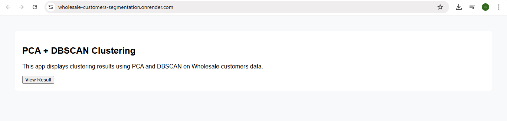
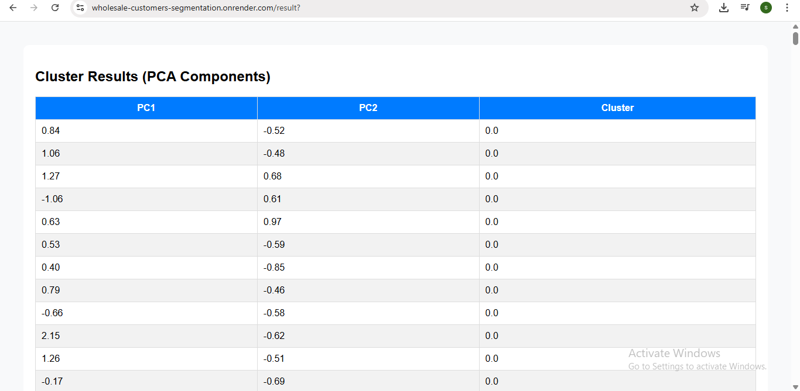

# Wholesale-customers-segmentation

This project uses **PCA (Principal Component Analysis)** to reduce the dimensionality of the Wholesale customers data, followed by DBSCAN clustering to group similar customer profiles. A lightweight **Flask web application** displays the clustering results, showing how customers are segmented. The app is deployable on platforms like **Render** for easy sharing and demonstration.

---

## Features

- Region – Encoded numeric value representing the customer's geographic area.
- Channel – Encoded type of customer (e.g., Retail or Hotel/Restaurant/Cafe).
- Spending Features – Includes Fresh, Milk, Grocery, Frozen, Detergents_Paper, and Delicassen.
- Numeric and Continuous – All features (except region/channel) represent annual monetary spending.
- Used for Clustering – All features are scaled, reduced via PCA, and then passed to DBSCAN for clustering.

---

## Prerequisites

Make sure the following are installed:

- Python 3.7 or higher installed
- Git installed and configured
- Basic knowledge of Python and Flask
- A GitHub account (for code hosting)
- Render account (for deployment)

---

## Installation

### 1. Clone the repository

```
git clone https://github.com/sandhiya0147/Wholesale-customers-segmentation.git
cd Wholesale-customers-segmentation
```

### 2. Install dependencies

```
pip install -r requirements.txt
```

---

## Running the Application

Start the Flask development server:

```
python app.py
```

Then open your browser and go to:

```
http://127.0.0.1:5000
```

---

## How It Works

- Load & Preprocess Data: The app reads the Wholesale customers dataset and applies standard scaling to normalize feature values.
- Dimensionality Reduction: PCA reduces the 8-dimensional data to 2 components for easier clustering and visualization.
- Clustering: DBSCAN groups similar customers and detects noise (outliers) based on density.
- Save Outputs: The clustered data along with the trained scaler, PCA, and DBSCAN models are saved for use in the app.
- Web Display: A Flask app loads the clustered results (clustered_data.csv) and displays them in a clean HTML table.

---

## File Structure

```
Wholesale-customers-segmentation
├── assets/                     
│   ├── segmentation.png
│   ├── summary.png
│
├── static/                      
│   └── style.css
│
├── templates/                   
│   └── index.html
│
├── Iris.csv                     
├── Procfile                     
├── README.md                    
├── app.py                       
├── model.pkl                    
├── model_train.py              
├── requirements.txt             
└── target_names.pkl             
```

---

## Future Improvements

- User Input Interface – Allow users to input new customer data and get cluster predictions dynamically.
- Cluster Visualizations – Add scatter plots of PCA components colored by cluster for better understanding.
- Filter & Search – Enable filtering clusters by channel, region, or spending range in the web UI.
- Multiple Clustering Methods – Integrate KMeans, Agglomerative, and DBSCAN with model comparison options.
- Real-Time Integration – Connect to live retail systems or APIs for continuous customer segmentation.

---


## Step-by-Step Guide: How to Use the Movie Interest Predictor


### Step 1: Input Form
  

### Step 2: Filled Form 
  


---

## Live Demo

[Click here to view the deployed app](https://wholesale-customers-segmentation.onrender.com)

---
